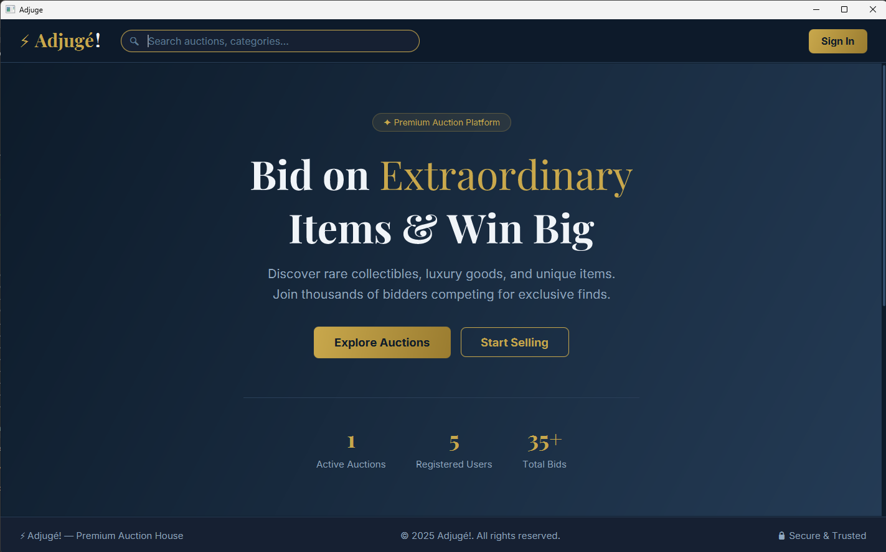

<div align="center">
  
  
  # ⚡ Adjugé! — Premium Auction Platform
  **Đồ án Bài tập lớn: Lập trình nâng cao (OOP)**
</div>

## 📖 Giới thiệu
**Adjugé!** là một hệ thống đấu giá trực tuyến cao cấp (Online Auction System) được xây dựng bằng Java và JavaFX. Dự án mang đến trải nghiệm người dùng mượt mà theo phong cách Single Page Application (SPA), giao diện Dark Mode sang trọng, tích hợp đấu giá thời gian thực và tuân thủ chặt chẽ các nguyên lý Thiết kế Hướng đối tượng (OOP) cũng như Design Patterns hiện đại.

Dự án được phát triển nhằm đáp ứng yêu cầu của bài tập lớn môn Lập trình nâng cao, bao gồm cả các tính năng cốt lõi và các kỹ thuật xử lý nâng cao (Concurrency, Real-time update).

---

## ✨ Tính năng nổi bật
* **Trải nghiệm UI/UX Cao cấp:** Giao diện tối sang trọng kết hợp hiệu ứng Glassmorphism, phong cách chữ (Typography) hiện đại và thống kê trực quan ngay từ trang chủ (Explore Auctions, Start Selling, Active Auctions, Registered Users...).
* **Đấu giá Thời gian thực (Real-time Bidding):** Tự động đếm ngược thời gian và cập nhật giá thầu, người dẫn đầu ngay lập tức mà không cần tải lại trang.
* **Xử lý Đấu giá Đồng thời (Concurrency Bidding):** Đảm bảo an toàn dữ liệu, tránh xung đột (race condition) và lỗi Lost Update khi nhiều bidder cùng đặt giá ở cùng một phần nghìn giây.
* **Hệ thống Đa Vai trò:** Quản lý quyền hạn linh hoạt giữa Bidder (Người mua), Seller (Người đăng bán) và Admin.
* **Tìm kiếm & Phân loại:** Hệ thống phân loại sản phẩm đa dạng (Art, Electronics, Vehicles, Fashion...) kết hợp thanh tìm kiếm thông minh.

## 🛠 Công nghệ sử dụng
* **Ngôn ngữ:** Java 17+ (hoặc 21+)
* **Giao diện:** JavaFX 24 kết hợp Custom CSS (Vanilla CSS)
* **Cơ sở dữ liệu:** SQLite (kết nối qua JDBC Driver)
* **Build Tool:** Maven (`pom.xml`) / Script chạy trực tiếp `run.bat`
* **Kiểm thử (Testing):** JUnit Platform

---

## 🏗 Kiến trúc Hệ thống & Lập trình Hướng Đối Tượng (OOP)
Dự án được thiết kế phân lớp chặt chẽ theo mô hình **MVC (Model-View-Controller)** và kiến trúc đa tầng (Controller → Service → DAO) để dễ dàng bảo trì và mở rộng.

### 1. Bốn Nguyên lý OOP Cốt lõi
* **Đóng gói (Encapsulation):** Che giấu logic nội tại và bảo vệ toàn vẹn dữ liệu trong các lớp Thực thể (Entities), chỉ cho phép truy cập qua `Getters/Setters` và các hàm chức năng.
* **Kế thừa (Inheritance):** Xây dựng cây phân cấp rõ ràng nhằm tái sử dụng mã (Ví dụ: Lớp trừu tượng `Item` → `Electronics`, `Art`, `Vehicle` hoặc `User` → `Bidder`, `Seller`, `Admin`).
* **Đa hình (Polymorphism):** Kỹ thuật Overriding để tùy biến các phương thức đặc thù của từng loại mặt hàng trên cùng một giao diện (Polymorphic UI rendering).
* **Trừu tượng (Abstraction):** Áp dụng linh hoạt Abstract Class và Interface định nghĩa các khuôn mẫu hành vi chung (như `Sellable`, `Biddable`).

### 2. Áp dụng Design Patterns
* **Singleton Pattern:** Quản lý kết nối duy nhất của Cơ sở dữ liệu (`DatabaseManager`) và dữ liệu nền tĩnh (`DataStore`), chống lãng phí bộ nhớ.
* **Observer Pattern:** Trái tim của cơ chế Real-time Update. Khi một `Auction` có sự thay đổi (giá mới, kết thúc thời gian), nó tự động `notify` để cập nhật đồng bộ lên UI của tất cả các Client đang theo dõi.
* **Factory Method Pattern:** Khởi tạo linh hoạt các đối tượng mặt hàng (`ItemFactory`) dựa trên danh mục (Category) mà người bán lựa chọn.
* **Strategy Pattern:** Đóng gói và cô lập các thuật toán kiểm tra tính hợp lệ của giá thầu (Bid Validation) để dễ dàng thêm mới các luật lệ đấu giá.

---

## 🚀 Hướng dẫn khởi chạy

### Cài đặt yêu cầu:
1. Đảm bảo hệ thống của bạn đã cài đặt **JDK 17** (hoặc mới hơn).
2. Tải (Clone) mã nguồn về máy.

### Chạy ứng dụng bằng Script (Windows):
Dự án đã tích hợp sẵn script tự động biên dịch và chạy. Bạn chỉ cần nháy đúp chuột vào tệp:
```cmd
run.bat
```

### Chạy ứng dụng bằng Maven:
Mở Terminal/Command Prompt tại thư mục gốc của dự án và chạy:
```bash
mvn clean compile javafx:run
```

---
### Một số hình ảnh demo về BTL:



## 👥 Nhóm phát triển
* **Thành viên 1:** Ninh Đức Hải - 25021747
* **Thành viên 2:** Nguyễn Hoàng Long - 2502
* **Thành viên 3:** [Họ và Tên] - [Mã sinh viên]
* **Thành viên 4:** [Họ và Tên] - [Mã sinh viên]
